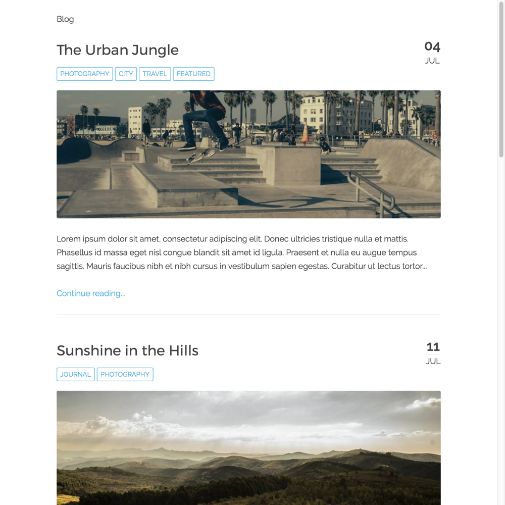

# Open Blogging Space Skeleton

**Open Blogging Space** with Git Sync is designed to support an open and collaborative publishing space, inside or outside of other platforms (e.g. LMS). Built with the open source modern file-based [Grav CMS](http://getgrav.org).

Information and Documentation
---
http://learn.hibbittsdesign.org/openpublishingspace

Quick Install Instructions
---
**Pre-flight Checklist**  

1. Confirm Web server PHP version (PHP 5.5.9 or higher)
2. Web server login credentials (username and password)

**Installation Steps**  

1. Download the ready-to-run [Open Blogging Space Skeleton Package](http://hibbittsdesign.org/blog/downloads/grav-skeleton-open-publishing-space-site.zip)
2. Unzip the package onto your desktop  
3. Copy the entire expanded folder to your Web server  
4. Point your browser to the Web server folder  
5. Create your site administrator account when prompted  
6. And you're done! (press the  icon in the Admin Panel to preview site)

Open Blogging Space Screenshot
---

This skeleton uses the [Quark Open Blogging theme](https://github.com/hibbitts-design/grav-theme-quark-open-publishing), a customized version of the [Quark theme](https://github.com/getgrav/grav-theme-quark).

Open Blogging Space Features Highlights
---
<table cellpadding="2" cellspacing="2" width="100%">
	<tbody>
		<tr>
			<td width="50%">
				<ul>
					<li>Ready-to-run open source <a href="http://getgrav.org">Grav</a> package</li>
					<li>Minimal server requirements (PHP 5.5.9 or higher, no database required)</li>
					<li>Built-in support for automatic two-way <a href="https://github.com/trilbymedia/grav-plugin-git-sync">Git Sync</a></li>
					<li>Global 'Chromeless Pages' site setting for all pages (for embedding entire site within another platform, e.g. LMS)
					<li>Optional 'chromeless' page URL flag (for embedding specific pages within another platform, e.g. LMS)
	        <li>Uses <a href="https://daringfireball.net/projects/markdown/">Markdown</a> and HTML files for cross-platform content</li>				
					<li>Full access to <a href="https://www.w3schools.com/html/default.asp">HTML</a>, <a href="https://www.w3schools.com/css/default.asp">CSS</a>, <a href="https://www.w3schools.com/js/default.asp">Javascript</a>, <a href="https://twig.symfony.com/doc/2.x/">Twig Templates</a>, <a href="http://www.yaml.org/">YAML</a>, etc.</li>
				</ul>
			</td>
			<td width="50%">
				<ul>
					<li>Featured posts (i.e. sticky posts)</li>
					<li>Option to toggle page summaries (i.e. summaries are not displayed with page content)</li>
					<li>Supports custom page types and modular content</li>
					<li>Site pages can be easily added/removed/changed</li>
					<li>External links can be automatically opened in a new Tab/Window</li>
          <li>Custom menubar items</li>
					<li>Markdown-based sidebar widget</li>
          <li>Creative Commons license display</li>
          <li>Various Web accessibility enhancements (i.e. hidden H1 page titles)</li>
				</ul>
			</td>
		</tr>
	</tbody>
</table>
